# Think It Twice: Sample iOS Swift Code

A mobile application for bringing **digital training solution** in the luxury retail industry.

* [Official site](https://youralbert.com/)
* [iOS App](https://apps.apple.com/ph/app/albert-daily-feed/id1193114829)

## Featured Codes

**Project Folder:** `/ DailyTraining`

1. `ChatMembersViewController` - **VIEW**

	* `ChatPeopleController` - **VIEW MODEL**
	* `ChatPeopleTableViewCell`
	* `ChatPeopleVM`
	
1. `ChatMessagingViewController` - **VIEW**

	* `ChatMessagingController` - **VIEW MODEL**
	* `ChatMessageTableViewCell`
	* `ChatOwnedMessageTableViewCell`
	* `ChatMessageVM`
	
1. `ChatManager` - **MODEL**

	* backend requests for SendBird server
	
	

		
		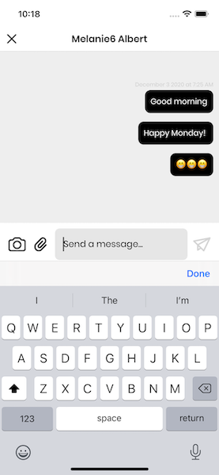
	

## MVVM Architectural Design Pattern

1. **Model**
	- returns the api model in **`struct` that extents to `Codable`**
2. **View**
	- the displayable **`UIViewController`**
	- use VM (model to display the view)
3. **View Model**
	- calls the network api
	- converts the api model in **custom `class` that extents to `NSObject`**

## SwiftUI Training

**PROJECT SPECIFICATIONS:**

- **Root Directory:** `/ DailyTraining-SwiftUI`
- **IDE:** `XCode 14.3.1 for iOS 16.4`
- **Language:** `Swift 5`
- **Interface:** `SwiftUI`
- [Architecture Diagram](https://drive.google.com/file/d/17IRKrt5H3WeYHVrtgEdXN8UVBIiFtWvO/view?usp=sharing)

**FEATURES**

- MVVM
- Data Cache: `Realm Database`
- Remember Me
- Image Caching
- API Integration
- Logger
- Reusable View Modifiers
	- Loader
	- Error Alert

**INSPIRED BY**

- [Sean Allen](https://www.youtube.com/@seanallen)
- [Karin Prater](https://www.youtube.com/@SwiftyPlace)

	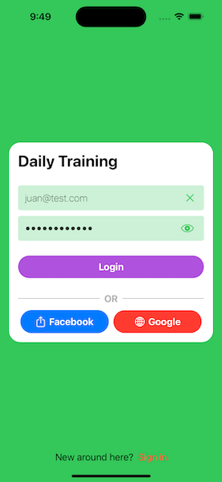
	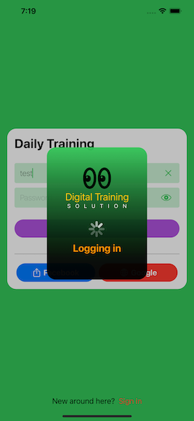
	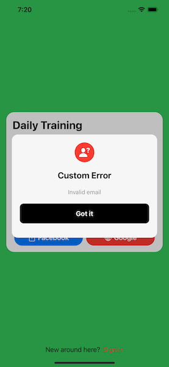
	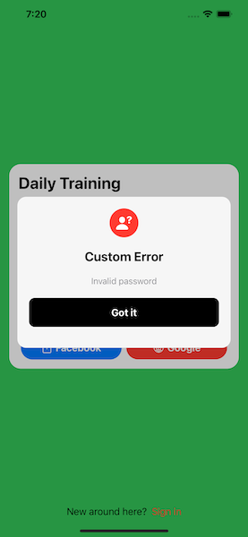

	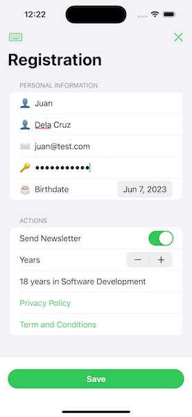
	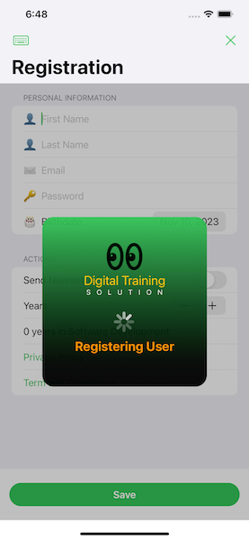
	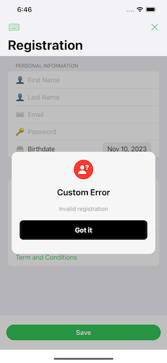

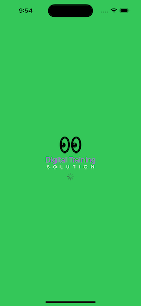
	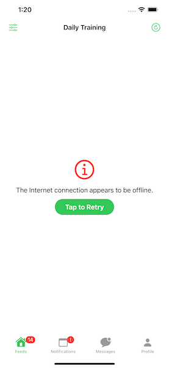

	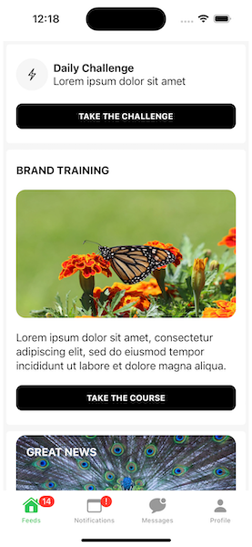
	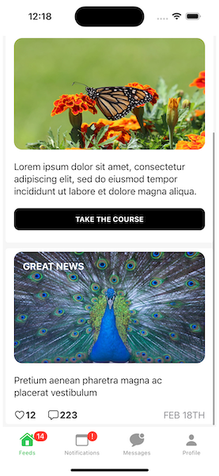
	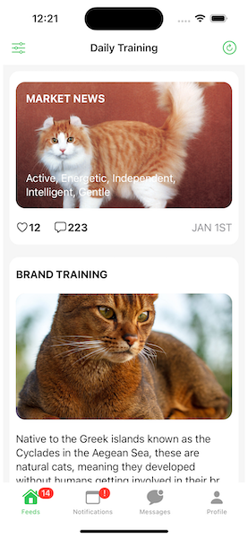
	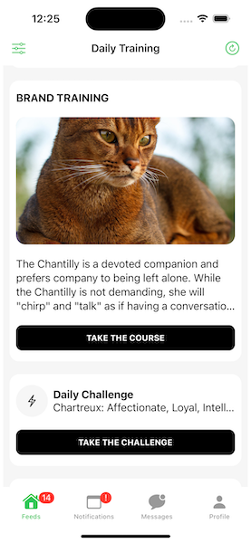
	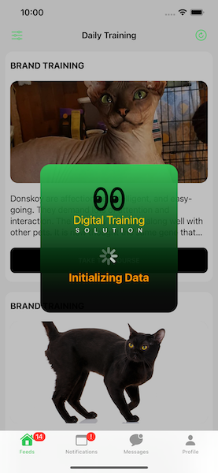
	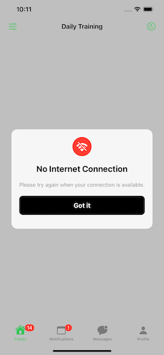

	
	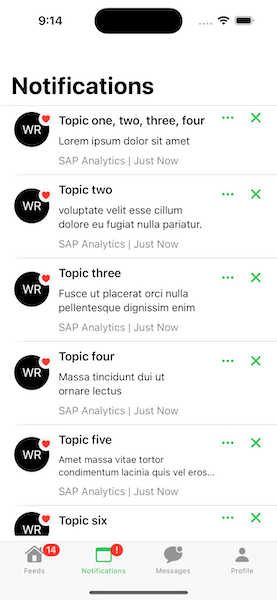
	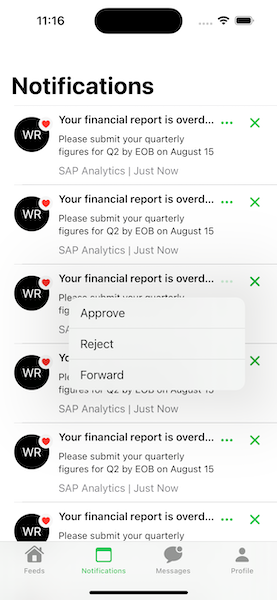
	
	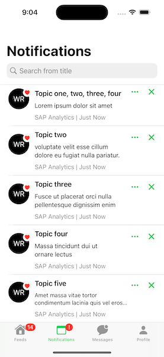
	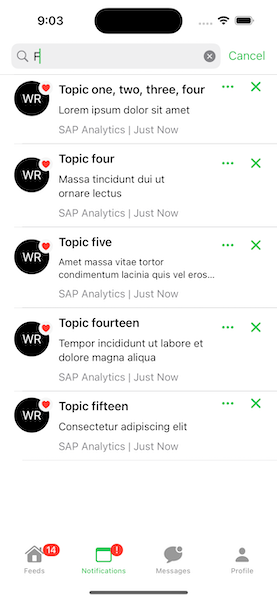

	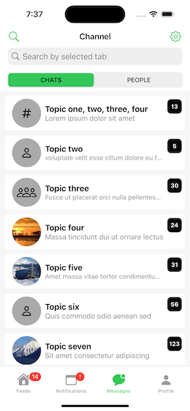
	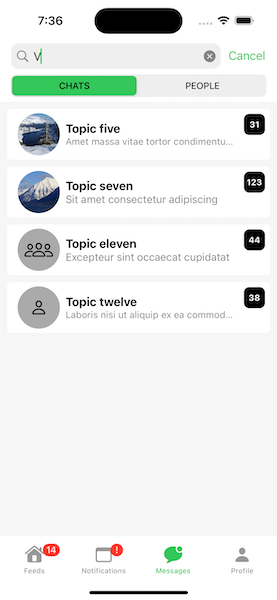
	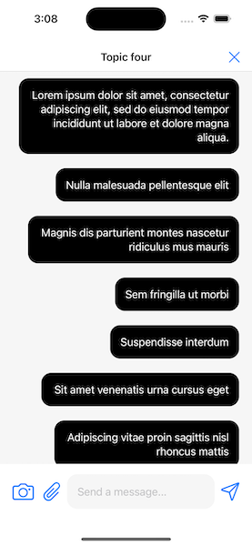

	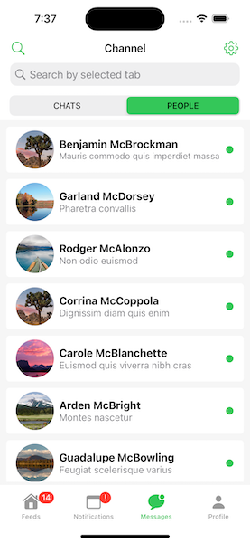
	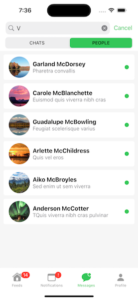

	
	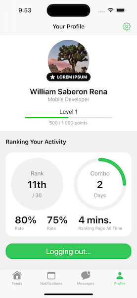
	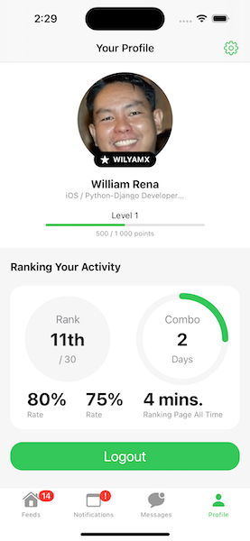

